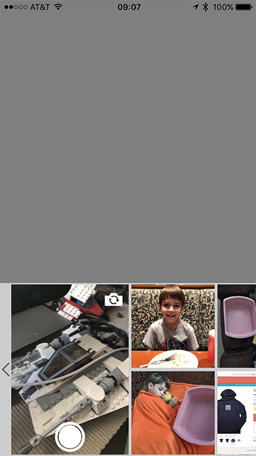

# Camera Picker

This is a simple Swift 3.0 library for adding a camera picker view that is strikingly similar to the one seen in Apple’s iMessage app.  Here’s a screenshot of it in action:

It gives users a mini-camera taking control, plus the previous 50 images in their camera roll.  Just like Apple’s version, however, users can swipe left to access the larger camera or full photo picker.

In addition, the included view controller can be configured to allow additional picking options that may be unique to your application.  For example, Camera Picker appears in [Trip Receipts](https://itunes.apple.com/us/app/trip-receipts-simple-expense/id703187946?ls=1&mt=8) that allows users to capture images from email and iCloud:

## Usage 

Clone or download this repo and add the enclosed Xcode project to your own, adding the `CameraPicker` framework to your iOS target.  Next, import the module into your code:

    import CameraPicker

There is a self-contained view controller class `CameraPickerViewController` that illustrates a typical usage of the underlying `CameraPickerView`.  It is as simple as creating a new instance, giving it a selection handler, and presenting it:

    weak var weakSelf = self
        
    let cameraPickerVC = CameraPickerViewController()
    cameraPickerVC.imageSelectionHandler = {(image: UIImage?) in
        weakSelf?.imageView.image = image
    }

    self.present(cameraPickerVC, animated: true, completion: nil)
    
Objective-C Example:

	__weak typeof(self) weakSelf = self;

    CameraPickerViewController *cameraPicker = [[CameraPickerViewController alloc] init];
    cameraPicker.imageSelectionHandler = ^(UIImage *image) {
        weakSelf.imageView.image = image;
    };

    [self presentViewController:cameraPicker animated:YES completion:NULL];

It’s really that easy.  If you want more control over the presentation of the CameraPicker, feel free to create your own view controller and handle that in a way that makes sense for your application: everything has been modularized for flexibility.

This is my first Swift project, so recommendation and pull requests are welcome!

## License

Copyright (c) 2016, Wayne Hartman
All rights reserved.

Redistribution and use in source and binary forms, with or without modification, are permitted provided that the following conditions are met:

1. Redistributions of source code must retain the above copyright notice, this list of conditions and the following disclaimer.

2. Redistributions in binary form must reproduce the above copyright notice, this list of conditions and the following disclaimer in the documentation and/or other materials provided with the distribution.

3. Neither the name of the copyright holder nor the names of its contributors may be used to endorse or promote products derived from this software without specific prior written permission.

THIS SOFTWARE IS PROVIDED BY THE COPYRIGHT HOLDERS AND CONTRIBUTORS "AS IS" AND ANY EXPRESS OR IMPLIED WARRANTIES, INCLUDING, BUT NOT LIMITED TO, THE IMPLIED WARRANTIES OF MERCHANTABILITY AND FITNESS FOR A PARTICULAR PURPOSE ARE DISCLAIMED. IN NO EVENT SHALL THE COPYRIGHT HOLDER OR CONTRIBUTORS BE LIABLE FOR ANY DIRECT, INDIRECT, INCIDENTAL, SPECIAL, EXEMPLARY, OR CONSEQUENTIAL DAMAGES (INCLUDING, BUT NOT LIMITED TO, PROCUREMENT OF SUBSTITUTE GOODS OR SERVICES; LOSS OF USE, DATA, OR PROFITS; OR BUSINESS INTERRUPTION) HOWEVER CAUSED AND ON ANY THEORY OF LIABILITY, WHETHER IN CONTRACT, STRICT LIABILITY, OR TORT (INCLUDING NEGLIGENCE OR OTHERWISE) ARISING IN ANY WAY OUT OF THE USE OF THIS SOFTWARE, EVEN IF ADVISED OF THE POSSIBILITY OF SUCH DAMAGE.
